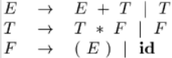
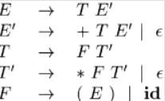
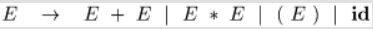
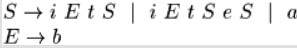

### 4.1 语法分析器介绍

- **核心任务**：检查**词法分析器输出的Token流**，判断这个Token序列能否构成一个符号语法规则的句子
- 语法分析(parsing)阶段的任务包括：与符号表交互，类型检查，语义分析，生成中间代码，但此处将其归并到“前端剩余部分”（Rest of front end）介绍
- 
- **在编译器中的位置**：编译器**前端的核心**，承上启下
  - **输入**：接收词法分析器输出的Token流
  - **输出**：生成语法分析树，传递给前端剩余部分
- **两种流派：** 语法分析器主要分为两种实现思路，但都是从左向右扫描输入
  - **自顶向下分析**：从开始符号出发，推导出目标句子
  - **自底向上分析**：从输入句子出发，尝试规约道开始符号
- **文法适用性**：
  - **LL文法**：常用于**手工构建**自顶向下的分析器
  - **LR文法**：常用于**自动构建**自底向上的分析器

#### 几种代表文法

##### 算符结合性与优先级

- 属于LR文法，可用于自底向上分析，不能用于自顶向下分析，因为存在**左递归**
- E represents expressions consisting of terms separated by + signs
- T represents terms consisting of factors separated by  * signs
- F represents factors that can be either parenthesized expressions or identifiers

##### 无左递归

- 可以用于自顶向下分析

##### 存在二义性

- 某些表达式的语法分析树不唯一

### 4.2 上下文无关文法（CFG）

语法分析器基于上下文无关文法工作

#### 基本构成

A context-free grammar consists of terminals, nonterminals, a start symbol, and productions.

- **终结符(Terminals)** 语言的基本符号，等同于词法单元名
- **非终结符(Nonterminals)** 语法的变量，代表终结符串的集合，用于构建语法层次
- **产生式(Productions)** 定义非终结符可以如何被替换为终结符和非终结符集合
- **开始符号(Start Symbol)**，一个特殊的非终结符，是推导的起点

#### 重要概念

- **推导(Derivation)**，从开始符号出发，不断应用产生式，最终得到字符串的过程
  - **最左推导**：每次替换最左非终结符
  - **最右推导（规范推导）**：每次替换最右非终结符
- **分析树(Parsing Tree)**：推导过程的图形化表示 ，一棵分析树可以对应多个推导过程，但**只能对应唯一最左推导和唯一最右推导**
- **二义文法(Ambiguous Grammat)**：对同一个句子有不同的最左或最右推导/生成多颗不同的分析树。二义性是语法分析中需要解决的问题。
- **规约**：构造一棵产出为 $a_i$ 的分析树
- **句型、句子**：如果 $S\stackrel{*}{\Rightarrow}\alpha$，S是文法G的开始符号，称 $\alpha$ 为G的一个句型，当 $\alpha$ 中无非终结符，称为文法G句子
- **语言L(G)**：文法的语言 $L(G)$ 是所有句子的集合，能由文法产生的语言称为上下文无关语言

#### 表达能力

CFG表达能力强于正则表达式（RE）

### 4.3构造文法

几种应用于语法的变换，使其更适合进行语法分析

- 消除二义性
- 左递归，左提取用于重写语法，使其适应自顶向下分析

#### 4.3.1语法分析和词法分析比较

文法可以表示正则表达式所描述的东西，那么为什么需要正则表达式来定义词法？

- 词法规则相较语法简单，无需更复杂的文法即可描述
- 将语言语法结构分为词法和语法两部分，有利于将编译器前端分解为两个独立组件
- 正则表达式为Token提供一种更为简单，简洁的符号表示法
- 利用正则表达式可以构造更为高效的词法分析器

#### 4.3.2消除二义性

#### 4.3.3消除左递归

自顶向下分析无法处理左递归文法

> 原文法： $A \rightarrow A\alpha_1 \mid A\alpha_2 \mid \ldots \mid A\alpha_m \mid \beta_1 \mid \beta_2 \mid \ldots \mid \beta_n$
>
> 消除左递归之后：
>
> $A \rightarrow \beta_1 A' \mid \beta_2 A' \mid \ldots \mid \beta_n A' $
>
> $A' \rightarrow \alpha_1 A' \mid \alpha_2 A' \mid \ldots \mid \alpha_m A' \mid \varepsilon$

#### 4.3.4消除回溯（左因子提取）

当两个可选产生式选择不明时，重写文法，推迟决策

> **Algorithm**：Left factoring a grammar
>
> **Input**：Grammar G
>
> **Output**：An equivalent left-factored grammar.
>
> 原文法： $A\to\alpha\beta_1|\alpha\beta_2|...|\alpha\beta_n|\gamma$
>
> 改造后的文法： $A\to \alpha A'|\gamma$        $A'\to \beta_1|\beta_2|...|\beta_n$

例1.