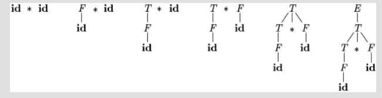
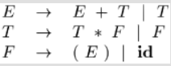
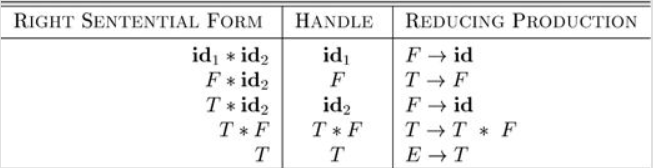
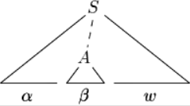
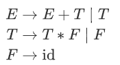
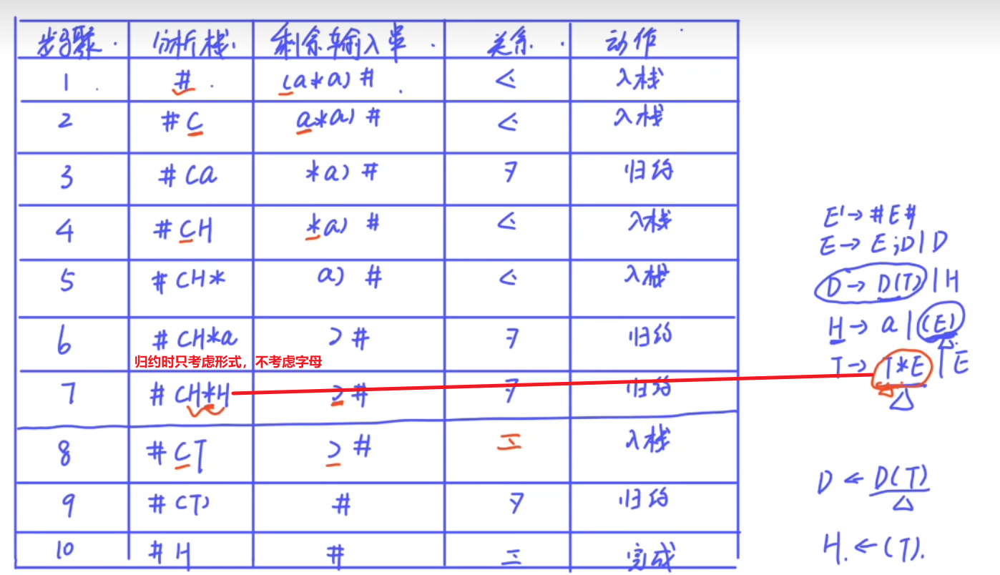
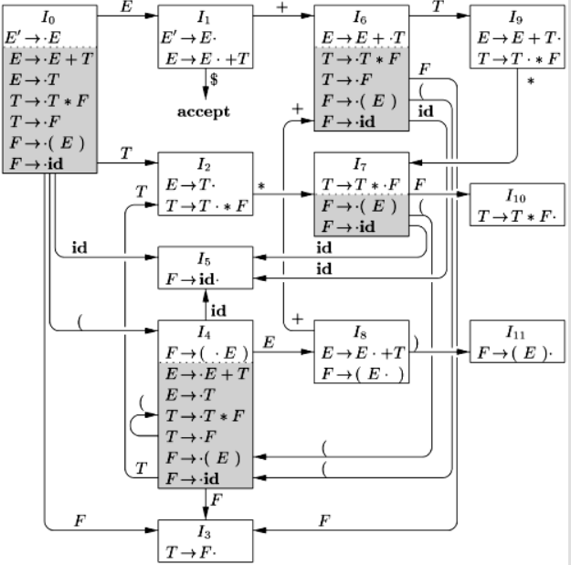

## 4.5 自底向上语法分析

- (Bottom-Up Parsing)

自底向上语法分析（Bottom-Up Parsing）对应于为输入串构造语法分析树的过程，该过程从叶子节点（底部）开始，逐步向上到达根节点（顶部）。

> **直观理解**：自底向上分析就像是侦探破案。侦探从现场发现的零散线索（终结符）开始，将它们组合成更大的线索块（将产生式体归约为产生式头），不断地进行推理和组合，最终还原出整个案件的全貌（归约为开始符号）。**借助语法树进行分析很方便**

这个过程可以看作是将一个输入串 $w$ **归约（reducing）** 为文法的开始符号。在归约的每一步，一个与某个产生式体匹配的特定子串被替换为该产生式的头（非终结符）。自底向上分析的关键决策是**何时归约**以及**用哪个句柄归约**。

> 自底向上分析的核心工作流：
>
> 1. 不断将输入符号移入分析栈
> 2. 当分析栈顶部形成一个句柄时，就将其归约为对应的产生式左部



[图片占位：一张展示对 id * id 进行自底向上分析的语法树构建快照序列。]

自底向上分析（**移进-规约**分析）实际上是反向构造一个**最右推导（rightmost derivation）**。

> 任何可以用**移进规约**分析法成功解析的文法，一定属于LR文法
>
> LR文法能够构建移进规约分析器，解析器生成器工具（Yacc）使用此文法

### 4.5.1 归约 

- (Reductions)

归约是推导步骤的逆过程。在自底向上分析中，我们的目标是反向构造一个推导。

**例题4.37**: 考虑表达式文法 (4.1) 



和输入串 $\textbf{id} * \textbf{id}$。归约过程可能经历以下字符串序列：

1.  $\textbf{id}*\textbf{id}$
2.  $F * \textbf{id}$ (将最左边的 $\textbf{id}$ 归约为 $F$，使用产生式 $F \rightarrow \textbf{id}$)
3.  $T * \textbf{id}$ (将 $F$ 归约为 $T$，使用产生式 $T \rightarrow F$)
4.  $T * F$ (将第二个 $\textbf{id}$ 归约为 $F$)
5.  $T$ (将 $T * F$ 归约为 $T$ ，使用产生式 $T \rightarrow T * F$)
6.  $E$ (将 $T$ 归约为 $E$，使用产生式 $E \rightarrow T$)

这个归约序列对应的最右推导是：

$$
E \Rightarrow_{rm} T \Rightarrow_{rm} T*F \Rightarrow_{rm} T*\textbf{id} \Rightarrow_{rm} F*\textbf{id} \Rightarrow_{rm} \textbf{id}*\textbf{id}
$$

### 4.5.2 句柄剪枝

- (Handle Pruning)

自底向上分析在从左到右扫描输入时，反向构造一个最右推导。

**句柄**

**一句话：当前句型 $\gamma$ 中找到一个子串 $\beta$ 将其换回 $A$， 看得到的是不是上一步的句型，若是，那么 $\beta$​ 就是句柄**

---

> **定义：句柄 (Handle)**
> 非正式地说，“句柄”是与某个产生式体匹配的子串，并且它的归约代表了最右推导逆过程中的一步。
>
> **直观理解**：句柄是当前句型中“最先”形成的那部分。它不是任何一个匹配产生式体的子串都可以。例如，在句型 $T * \textbf{id}$ 中，虽然子串 $T$ 匹配产生式 $E \rightarrow T$ 的体，但它不是句柄。因为在最右推导中， $T * \textbf{id}$ 是由 $T*F$ 推导出来的，而不是由 $E * \textbf{id}$ 推导出来的。正确的下一步归约应该是将 $\textbf{id}$ 归约为 $F$。因此， $\textbf{id}$ 才是句柄。
>

**形式化定义**
如果 $S \Rightarrow_{rm}^* \alpha A w \Rightarrow_{rm} \alpha \beta w$，其中 $w$ 仅包含终结符，那么在右句型(right-sentential) $\alpha \beta w$ 中，紧跟在 $\alpha$ 之后的位置上的产生式 $A \rightarrow \beta$ 就是一个**句柄**。
或者，右句型 $\gamma$ 的一个句柄，是由一个产生式 $A \to \beta$ 和 $\gamma$ 中的一个特定位置共同定义的。其条件是：将在该位置的子串 $\beta$ 替换为非终结符 $A$后，所得到的新字符串，恰好是 $\gamma$ 在其最右推导序列中的前一个右句型

>右句型：似乎是串的最右侧为终结符，最右推导的中间结果



[图片占位：一棵语法分析树，展示了句柄 A -> β 在右句型 αβw 中的位置。]

如果一个文法是无歧义的，那么它的每个右句型都只有一个唯一的句柄。通过反复进行“**句柄剪枝**”（即找到并归约句柄，得到前一个右句型），我们可以从一个句子开始，逐步归约，最终得到开始符号。

#### 4.5.2.A一些概念

---

**利用语法树求解短语，直接短语，句柄，素短语，最左素短语**

从文法的开始符号经过0步或若干步推导所得到的符号串是文法的一个**句型**。

只含终结符的句型叫做**句子**。

文法的所有句子的全体叫做**语言**，记作L(G)。

一个句型对应的语法树中，任一子树的叶节点所组成的符号串都是该句型的**短语**。

一个句型对应的语法树中，任一**最小子树**（只有两层）的叶节点所组成的符号串都是该句型的**直接短语**。

同一个句型的所有直接短语中，在语法树中最靠左的那个叫做句型的**句柄**。

**规范归约**：每次将句柄归约为产生式左部非终结符

**素短语**是特殊的短语，它包含至少一个终结符，且其本身不包含其他素短语。

在语法树中最靠左的素短语叫做**最左素短语**，算符优先分析中的可gui'yue

一个字的任意首部（包括ε）称为字的**前缀**。

**活前缀**：规范句型的一个前缀，这种前缀不含句柄之后的任何符号。

---

### 4.5.3 移入-归约语法分析 

- (Shift-Reduce Parsing)

移入-归约语法分析是自底向上分析的一种形式，它使用一个**栈**来存放文法符号，一个**输入缓冲区**存放待处理的字符串。
*   **核心思想**：句柄一定出现在栈顶而不是栈内。（向栈顶输入一个或多个符号才会得到句柄）
* **约定**：我们使用 `$` 标记栈底和输入串的末尾。在讨论自底向上分析时，通常将栈顶显示在右侧。
``````
  STACK			 INPUT
  $					w$
``````

**分析器的四种可能动作**：
1.  **移入 (Shift)**：将下一个输入符号移到栈顶。
2.  **归约 (Reduce)**：当栈顶的符号串形成一个句柄 $\beta$ 时，用相应的产生式头 $A$ 替换它 ($A \rightarrow \beta$)。
3.  **接受 (Accept)**：当栈中只包含开始符号且输入缓冲区为空时，宣布分析成功。
4.  **报错 (Error)**：发现一个语法错误，并调用错误恢复例程。

**例题**: 对输入串 `id * id` 进行移入-归约分析。

| STACK               | INPUT                          | ACTION                                |
| :------------------ | :----------------------------- | :------------------------------------ |
| $                   | $\textbf{id} \ * \textbf{id}$ $ | shift                                 |
| \$ $\textbf{id}$     | $\ * \textbf{id}$ $             | reduce by $F \rightarrow \textbf{id}$ |
| $ F                 | $\ * \textbf{id}$ $             | reduce by $T \rightarrow F$           |
| $ T                 | $\ * \textbf{id}$ $             | shift                                 |
| $ T   *           | $\textbf{id}$ $                | shift                                 |
| \$ T* $\textbf{id}$ | $                              | reduce by $F \rightarrow \textbf{id}$ |
| $T  * F          | $                              | reduce by $T \rightarrow T * F$       |
| $ T                | $                              | reduce by $E \rightarrow T$           |
| $ E                 | $                              | accept                                |

### 4.5.4 移入-归约分析中的冲突 

- (Conflicts During Shift-Reduce Parsing)

不是所有**上下文无关文法**都能用**移进—归约**分析器解析，因为分析器可能会遇到无法做出唯一决定的配置。这类文法被称为**非LR文法**。一个二义文法一定不是LR文法

```
<stmt> ::=
    | if <expr> then <stmt>
    | if <expr> then <stmt> else <stmt>
    | other
```

**1. 移入/归约冲突 (Shift/Reduce Conflict)**

> **定义**：分析器在某个状态下，既可以对栈顶的句柄进行归约，也可以将下一个输入符号移入栈中。
> **直观理解**：分析器面临一个抉择：“我是应该满足于现在栈顶已形成的结构（归约），还是应该等待更多的输入符号进来，以形成一个更大的结构（移入）？”
> **经典例子**：悬空-else文法。当栈顶是 `if expr then stmt`，而下一个输入是 `else` 时，分析器不知道是应该将 `else` 移入（与当前的 `then` 匹配），还是应该将 `if expr then stmt` 归约为 `stmt`（认为这是一个没有 `else` 的if语句）。

**2. 归约/归约冲突 (Reduce/Reduce Conflict)**

> **定义**：分析器在某个状态下，栈顶的符号串可以匹配多个产生式的体，导致它不知道应该用哪个产生式进行归约。
> **直观理解**：分析器确定要归约，但发现栈顶的这个“线索块”可以由不止一种方式解释，即它可以归约为不同的非终结符。
> **例子**: 考虑一个语言，其中过程调用和数组引用的语法形式相同，例如 `id(parameter_list)`。假设文法中有如下产生式：
>
> ```
> (5) parameter -> id
> (7) expr -> id
> ```
> 当分析器看到 `p(i, j)` 并将 `p(i` 移入栈后，下一个输入是 `,`。栈顶的 `i`（一个`id`）需要被归约。但它应该被归约为 `parameter`（如果`p`是过程）还是 `expr`（如果`p`是数组）？仅凭语法信息无法决定。这种决策需要符号表中的信息。

## 4.5.A算符优先分析法

[编译原理期末速成bilibili——P5-6](https://www.bilibili.com/video/BV1Qb4y1Y7oJ/?spm_id_from=333.1387.upload.video_card.click&vd_source=91393d9709ce53cabe55a09644afd371)

一种简单直观的**自底向上**分析方法，只适用于**算符优先文法**，是一个不大的文法类。

**不是规范归约**，但分析速度快，可以用于表达式分析


核心思路：定义算符（终结符）之间某种优先关系，利用这种优先关系寻找 **"可归约串"**。


图 算符优先分析法流程图


优先分析方法的优缺点

- 优点：在确定句柄时只考虑终结符的优先关系，**效率高**
- 缺点：去掉非终结符间的归约，有可能将错句识别为正确的，**正确率低**

### 1.算符优先文法的判断

- (Operator-Precedence Grammar)

**定义**

---

**Step1.** 判断是否是**算符文法**，"**没有相邻非终结符出现在产生式右部**"

**Step2.** 假设G是不含 $\varepsilon$ 产生式的算符文法。对于任意一对终结符a,b。定义：

-  $a\doteq b$ ，当且仅当G中含有形如 $P\to \cdots ab\cdots$ 或 $P \to \cdots aQb \cdots$ 的产生式
-  $a \lessdot b$ ，当且仅当G中含有形如 $P\to \cdots aR \cdots$ 的产生式 而 $R\overset{+}{\rightarrow} b\cdots | Qb\cdots$
- $a \gtrdot b$ ，当且仅当G中含有形如 $P\to \cdots Rb\cdots$的产生式，而 $R\overset{+}{\rightarrow} \cdots a | \cdots aQ$

如果一个算符文法G中的任何终结符对（a,b）最多满足上述三个条件之一，则称G是一个**算符优先文法**。

$\cdots$​​ 代表由终结符和非终结符组成的任意序列，包括空字。

---

第一步可以在构造**优先关系表**时体现，需要我们检查的只有是否有空产生式

>**具体判断** 
>
>- 不是：选择一对终结符，说明其满足两种优先级关系
>- 是：`该文法任一产生式右部都不含两个相继的非终结符，故为算符文法。从优先关系表可以看出，任何两个终结符之间至多满足=，<，>，三种关系之一，故该文法为算符优先文法。`

> 为什么这样定义优先级：
>
> 通过定义优先级，标识句柄的**开始和结束**

| 关系    | 栈顶 `a` vs 输入 `b`  | 含义                                     | 动作                         | 目的                                       |
| :------ | :-------------------- | :--------------------------------------- | :--------------------------- | :----------------------------------------- |
| **`<`** | `a` 的优先级低        | 句柄**还没开始**，`b` 是一个新句柄的开始 | **Shift (移入)** `b`         | 进入更高优先级的子表达式                   |
| **`≐`** | `a` 和 `b` 优先级相同 | `a` 和 `b` 在**同一个句柄**内部          | **Shift (移入)** `b`         | 继续构建当前句柄                           |
| **`>`** | `a` 的优先级高        | 栈顶的 `a` 是一个句柄的**结尾**          | **Reduce (归约)** 栈顶的句柄 | 已经找到了一个完整的子表达式，可以处理它了 |
### 2.构造集合

>为什么需要构造FirstVT和LastVT两个集合？
>在对**算符优先级**进行定义时，需要寻找一个非终结符的首终结符和尾终结符，定义：
>
>- 首终结符集， $FIRSTVT(B) = \{b \mid B \rightarrow b... \text{或} B \rightarrow Cb...\}$
>
>- 尾终结符集， $LASTVT(B) = \{b \mid B \rightarrow ...b \text{或} B \rightarrow ...bC\}$​
>
>所以，这是对算符优先级新的表示：
>
>- =关系， $A\to \cdots ab\cdots|\cdots aRb\cdots$
>
>- <关系， $A\to \cdots aB\cdots$ ，对于每一个 $b \in FirstVT(B)$ ，都有a<b
>
>- \> 关系， $A\to \cdots Bb\cdots$ ，对于每一个 $a\in LastVT(B)$ ，都有a>b

##### FirstVT集合

> 若有产生式 $P\to a\cdots$ 或 $P\to Ra\cdots$ ，则 $a\in FirstVT(P)$
>
> 若有产生式 $P\to R\cdots$ ，则 $FirstVT(R)\in FirstVT(P)$​
>
> > **即每个产生式第一个终结符，向下递归。从前向后看**

##### LastVT集合

> 若有产生式 $B\to \cdots a$ 或 $B\to\cdots aQ$ ，则 $a\in LastVT(B)$
>
> 若有产生式 $B\to \cdots Q$ ，则 $LastVT(Q) \in LastVT(B)$​ 
>
> >**即每个产生式最后一个终结符，向下递归。从后向前看**


**Exercises for A.1**

```
G[E]:
  E -> E + T | E - T | T
  T -> T * F | T / F | F
  F -> (E)  | i
```


```
FirstVT[E] = { (, *, +, -, /, i }
FirstVT[F] = { (, i }
FirstVT[T] = { (, *, /, i }

LastVT[E]  = { ), *, +, -, /, i }
LastVT[F]  = { ), i }
LastVT[T]  = { ), *, /, i }
```


**步骤：**

**求 $E$ 的 $FirstVT$ 时**，对于 $E\to E+T$ 第一个终结符为 $+$ ， $E\to E-T$ 同理，

对于 $E\to T$，向下递归， 对于 $T\to T * F$ 第一个终结符为 $ * $ ， $T\to T/F$ 同理，

对于 $T\to F$ ，向下递归，对于 $F\to(E)$ ，第一个终结符为 $($ ，对于 $F\to i$ ，第一个终结符为 $i$

所以 $FirstVT(E)=\{+,-,*,/,(,i\}$

**求 $E$ 的 $LastVT$ 时**，从后向前看第一个终结符，对于 $E\to E+T$，最后一个终结符为 $+$ ，等等

### 3.构造优先关系表

**如果一个文法构造出的优先关系表没有冲突项，该文法为算符优先文法**

- 如果存在 $P\to \cdots ab\cdots$ 或者 $P \to \cdots aQb \cdots$ 则置 $a=b$ ，横看
- 如果存在 $Q\to \cdots aP\cdots$ ，则对于 $b\in FirstVT(P)$ ， $a<b$ ，横看
- 如果存在 $Q\to\cdots Pb\cdots$ ，则对于 $a\in LastVT(P)$ ， $a>b$ ，竖看

**步骤：**行列写出 所有终结符+开始结束符号#，添加  $ \# S \#，S$ 为开始符号

1. 找相等优先级
2. 找 **"终结符a+非终结符P"** 形式，找到a所在行，若元素在 $FirstVT(P)$ 中，相应位置写 $\lessdot$
3. 找 **"非终结符P+终结符b"** 形式，找到b所在列，若元素在 $LastVT(P)$ 中，相应位置写 $\gtrdot$


### 4.算符优先分析

算符优先分析法的基本原理是：通过**优先关系**识别句柄并归约，比较**栈顶终结符** $a$ 和**输入的下一个符号** $b$​​ 的优先级，

- 如果**"栈顶终结符"**的优先级低，则**"移进"**输入字符串的下一个符号，

- 如果**"栈顶终结符"**优先级高，则去寻找句柄（与产生式右部的形式是否一致，此过程可能识别错误）进行**"归约"**

分析过程中的可能情况（移进—归约分析器的四种可能动作）：

- 移进，输入元素大于栈顶元素
- 归约，输入元素小于栈顶元素
- 接受：$$相遇
- 报错：栈顶元素和当前输入元素没有优先关系

**例：设算符文法为：**




<center>优先关系表</center>

**对 $id + id * id$ 进行分析**

向输入字符**插入优先关系**后，得到符号串 $\$\lessdot id\gtrdot+\lessdot id\gtrdot *\lessdot id\gtrdot \$$

经过下面的过程得到**句柄**：

1. 从左向右扫描串，如果**输入元素优先级高于当前元素，移入输入元素**。直到遇到第一个 $\gtrdot$ （**输入元素优先级低于当前元素**）
2. 找到 $\gtrdot$ 后，向左扫描，跳过所有 $\doteq$ ,直到遇到一个 $\lessdot$ 为止
3. **句柄**包括第二步遇到的 $\lessdot$ 到第一个 $\gtrdot$ 之间的所有内容，由于 $id$ 可以归约为 $E$ ，从而得到右句型 $E + id * id$ ，按同样步骤将剩余两个 $id$ 归约，得到右句型 $E + E * E$ 
4. 现在考虑**忽略非终结符**后的符号串 $\$\lessdot +\lessdot *\gtrdot \$$ ，与前面过程类似可得**句柄**位于 $*$ 附近，即右句型 $E + E * E$ 中，句柄为 $E*E$ ，两边非终结符也在其中

用栈实现上述"**移进—归约**"算法如下：


例



## 4.6 简单LR (SLR)

本节介绍LR分析的基本概念，以及最简单的LR分析表构造方法，称为“**简单LR**”（Simple LR，简称SLR）。

基础概念将从“**项**”和“**分析器状态**”开始，这些是理解LR分析器生成器**诊断信息**的关键，能够帮助我们定位和解决语法分析中的冲突。

### 4.6.1 为何选择LR分析器？

LR分析器是表驱动的，非常类似于我们在4.4.4节中讨论的非递归LL分析器。

> 一个文法是LR的，本质上意味着一个从左到右扫描的移入-规约分析器，能够仅通过查看栈顶的内容，就准确地识别出句柄（handle）。

LR分析法之所以如此吸引人，有以下几个原因：

*   **强大的表达能力**：LR分析器几乎可以识别所有上下文无关语言。
*   **最通用的非回溯方法**：LR分析法是已知的最通用的非回溯移入-规约分析方法
*   **及时的错误检测**：LR分析器能够在从左到右扫描输入时，以最快的速度发现语法错误。
*   **更广泛的文法类别**：LR文法能描述比LL文法更广泛的语言。一个文法是LR(k)的，意味着我们只需要向前看 $k$ 个输入符号就能识别出产生式的右部。这个要求比LL(k)文法宽松得多，后者要求仅凭产生式右部推导出的前 $k$ 个符号就要能做出决策。因此，

LR方法的主要缺点是为典型的程序设计语言文法手动构造一个LR分析器工作量巨大。因此，通常需要一个专门的工具——**LR分析器生成器**（如Yacc或Bison）。

### 4.6.2 项和LR(0)自动机

一个移入-规约分析器如何知道**何时移入**、**何时规约**？

答案是，LR分析器通过维护 **状态** 来跟踪分析过程。状态代表了“项”的集合。

**定义：LR(0)项**
一个文法 $G$ 的一个 **LR(0)项** (item) 是 $G$ 的一个产生式，其右部的某个位置有一个点 `·`。例如，产生式 $A \rightarrow XYZ$ 会产生以下四个项：
$$
\begin{aligned}
A &\rightarrow \cdot XYZ \\
A &\rightarrow X \cdot YZ \\
A &\rightarrow XY \cdot Z \\
A &\rightarrow XYZ \cdot
\end{aligned}
$$

产生式 $A \rightarrow \epsilon$ 只产生一个项：$A \rightarrow \cdot$ 。

> **直观理解**：
> 一个项就像一个书签，它告诉我们在分析过程中，我们已经看到了一个产生式的多大一部分。
>
> *   `·` 在最左边 ( $A \rightarrow \cdot XYZ$ )：表示我们期望接下来能看到可以从 `XYZ` 推导出的串。
> *   `·` 在中间 ( $A \rightarrow X \cdot YZ$ )：表示我们刚刚在输入中识别了一个可以从 `X` 推导出的串，并期望接下来能看到从 `YZ` 推导出的串。
> *   `·` 在最右边 ( $A \rightarrow XYZ \cdot$​ )：表示我们已经完整地看到了产生式 `XYZ` 的所有部分，这可能是一个规约的时机。

**LR(0)自动机**

> One collection of sets of LR(0) items, called the canonical（规范） LR(0) collection, provides the basis for constructing a deterministic finite automaton that is used to make parsing decisions.In particular, each state of the **LR(0) automaton** represents a set of items in the canonical LR(0) collection.
>
> LR(0)自动机的每个状态代表一个项集


为了构造LR分析器，我们首先需要为文法定义一个 **增广文法**。如果 $G$ 是一个以 $S$ 为开始符号的文法，那么 $G$ 的增广文法 $G'$ 就是在 $G$ 的基础上增加一个新的开始符号 $S'$ 和一个新产生式 $S' \rightarrow S$​。

> **直观理解**：
> 引入 $S' \rightarrow S$ 这个产生式的目的是为了给分析器一个明确的“接受”信号。
>
> 只有当分析器准备按照这个唯一的产生式进行规约时，才意味着整个输入串已经被成功解析。

#### Closure函数 (项集的闭包)

为了从项集构造自动机，我们需要两个核心函数：`CLOSURE` 和 `GOTO`。

**定义：CLOSURE(I)**
如果 $I$ 是一个文法的项集，那么 **CLOSURE($I$)** 是通过以下两条规则从 $I$ 构造出来的项集：

1.  初始时，将 $I$ 中的每一个项都加入到 CLOSURE($I$) 中。
2.  如果 $[A \rightarrow \alpha \cdot B \beta]$ 在 CLOSURE($I$) 中，且 $B \rightarrow \gamma$ 是一个产生式，那么将项 $[B \rightarrow \cdot \gamma]$ 也加入到 CLOSURE($I$) 中（如果它不在的话）。重复此过程，直到没有新的项可以加入为止。

> **直观理解**：
> 计算闭包的过程可以看作是“展开期望”。如果我们的书签（`·`）正位于一个非终结符 `B` 前面，意味着我们下一步需要识别 `B`。为了做到这一点，我们必须考虑 `B` 可能推导出的所有情况。因此，我们把所有 `B` 的产生式（并且书签在最前面）也加入到当前的状态中，表示这些也是我们接下来可能要匹配的模式。

**例题 4.40**：考虑下面的增广文法：

$$
\begin{aligned}
E' &\rightarrow E \\
E &\rightarrow E + T \ | \ T \\
T &\rightarrow T * F \ | \ F \\
F &\rightarrow (E) \ | \ \mathbf{id}
\end{aligned}
$$

如果初始项集 $I = \{[E' \rightarrow \cdot E]\}$，计算 CLOSURE($I$)。

**解题步骤**：
1.  **初始**：将 $[E' \rightarrow \cdot E]$ 加入 CLOSURE($I$)。
2.  **第一次展开**：`·` 在非终结符 $E$ 的前面。因此，我们将所有 $E$ 的产生式，并把 `·` 放在最前面，加入到集合中。得到新项：$[E \rightarrow \cdot E + T]$ 和 $[E \rightarrow \cdot T]$。
3.  **第二次展开**：现在集合中有 $[E \rightarrow \cdot E + T]$ 和 $[E \rightarrow \cdot T]$。我们先看 $[E \rightarrow \cdot T]$，`·` 在非终结符 $T$ 前面。因此，我们将所有 $T$ 的产生式加入集合。得到新项：$[T \rightarrow \cdot T * F]$ 和 $[T \rightarrow \cdot F]$。
4.  **第三次展开**：现在集合中有 $[T \rightarrow \cdot F]$，`·` 在非终结符 $F$ 前面。因此，我们将所有 $F$ 的产生式加入集合。得到新项：$[F \rightarrow \cdot (E)]$ 和 $[F \rightarrow \cdot \mathbf{id}]$。
5.  **结束**：新加入的两个项的 `·` 后面都是终结符，无法再展开。因此，闭包计算完成。

最终得到的项集 $I_0 = \text{CLOSURE}(\{[E' \rightarrow \cdot E]\})$ 是：

$$
\begin{aligned}
I_0: \quad &E' \rightarrow \cdot E \\
&E \rightarrow \cdot E + T \\
&E \rightarrow \cdot T \\
&T \rightarrow \cdot T * F \\
&T \rightarrow \cdot F \\
&F \rightarrow \cdot (E) \\
&F \rightarrow \cdot \mathbf{id}
\end{aligned}
$$

这个项集 $I_0$​ 将成为我们LR(0)自动机的开始状态。


**如何高效存储和表示项集？**

如果将项集分为两类：核心项和非核心项

- 核心项：初始项*S* ′ → ·*S*和所有 " . " 不在产生式体最左端的项
- 非核心项：所有" . "在产生式体最左端，且不是初始项

核心项的特点：**原创，不可推导**。通常通过GOTO函数得到

非核心项特点：对核心项利用Closure函数**推导**得到

> 一个项集中只需存储核心项，非核心项可以通过Clousure函数推导得到

#### GOTO函数

**定义：GOTO(I, X)**
$GOTO(I, X)$ 函数定义为项集 $[A \rightarrow \alpha X \cdot \beta]$ 的闭包，其中 $[A \rightarrow \alpha \cdot X \beta]$ 必须在 $I$ 中。$X$ 是一个文法符号。

> **直观理解**：
> `GOTO` 函数定义了自动机的状态转换。它回答了这样一个问题：“如果我们当前处于状态 `I`，并且成功地从输入中识别出了符号 `X`，那么我们应该转换到哪个新状态？” 这个新状态就是通过将 `I` 中所有形如 $[A \rightarrow \alpha \cdot X \beta]$ 的项中的 `·` 向右移动一位越过 `X`，然后对得到的新项集再取闭包而形成的。

**例题 4.41**：对于上面得到的项集 $I_0$，计算 $GOTO(I_0, E)$ 和 $GOTO(I_0, \mathbf{id})$。

**解题步骤**：
1.  **计算 $GOTO(I_0, E)$**：
    *   在 $I_0$ 中查找 `·` 后面是 $E$ 的项。我们找到 $[E' \rightarrow \cdot E]$ 和 $[E \rightarrow \cdot E + T]$。
    *   将 `·` 移动到 $E$ 之后，得到核心项集 $\{[E' \rightarrow E \cdot], [E \rightarrow E \cdot + T]\}$。
    *   计算这个核心项集的闭包。$[E' \rightarrow E \cdot]$ 无法展开。$[E \rightarrow E \cdot + T]$ 的 `·` 后面是终结符 `+`，也无法展开。
    *   因此，$I_1 = GOTO(I_0, E) = \{[E' \rightarrow E \cdot], [E \rightarrow E \cdot + T]\}$。

2.  **计算 $GOTO(I_0, \mathbf{id})$**：
    *   在 $I_0$ 中查找 `·` 后面是 `id` 的项。我们找到 $[F \rightarrow \cdot \mathbf{id}]$。
    *   将 `·` 移动到 `id` 之后，得到核心项集 $\{[F \rightarrow \mathbf{id} \cdot]\}$。
    *   计算闭包。由于 `·` 已经在最右边，无法展开。
    *   因此，$I_5 = GOTO(I_0, \mathbf{id}) = \{[F \rightarrow \mathbf{id} \cdot]\}$。

通过反复应用`CLOSURE`和`GOTO`函数，我们就能为文法构造出 **LR(0)自动机**，它的每个状态都是一个LR(0)项集。



[图片占位：表达式文法的LR(0)自动机。该图展示了所有状态（I0到I11），以及它们之间的GOTO转换关系。]

### 4.6.3 LR分析算法

一个LR分析器由 **输入**、**输出**、一个 **栈**、一个 **驱动程序** 和一个 **分析表** 组成。分析表有两个部分：**ACTION** 表和 **GOTO** 表。

[图片占位：图4.35，一个LR分析器的模型图，展示了栈、输入、分析表和驱动程序之间的交互。]

*   **栈**：存放一系列状态 $s_0s_1...s_m$，其中 $s_m$ 在栈顶。
*   **ACTION表**：`ACTION[s, a]` 指明了当栈顶状态为 $s$，当前输入符号为 $a$ 时，分析器应执行的动作。动作有四种：
    1.  **移入(Shift) j**：将输入符号 $a$ 移进栈，并将状态 $j$ 压入栈顶。
    2.  **规约(Reduce) A → β**：将栈顶的 $|\beta|$ 个符号弹出，然后将非终结符 $A$ 对应的新状态压入栈。
    3.  **接受(Accept)**：分析成功，停止。
    4.  **错误(Error)**：发现语法错误。
*   **GOTO表**：`GOTO[s, A]` 指明了当栈顶状态为 $s$，且刚完成一个到非终结符 $A$ 的规约时，下一个应该进入的状态。

#### 算法4.44：LR分析算法

**输入**：一个输入串 $w$ 和一个LR分析表。
**输出**：如果 $w$ 合法，输出其自底向上分析过程中的规约步骤；否则，报告错误。

**方法**：

1.  初始时，栈中只有初始状态 $s_0$，输入缓冲区为 $w\$$。
2.  设栈顶状态为 $s$，当前输入符号为 $a$。
3.  重复执行以下步骤，直到遇到 `accept` 或 `error` 动作：
    *   **if `ACTION[s, a] = shift j`**：将状态 $j$ 压入栈，输入指针前移。
    *   **else if `ACTION[s, a] = reduce A → β`**：从栈中弹出 $|\beta|$ 个状态。设弹出后栈顶的状态为 $s'$。将 $GOTO[s', A]$ 压入栈。输出产生式 $A \rightarrow \beta$。
    *   **else if `ACTION[s, a] = accept`**：分析完成。
    *   **else**：调用错误恢复例程。

[图片占位：图4.36，LR分析程序的伪代码。]

**例题 4.35**：使用图4.37的分析表，追踪对输入串 `id * id + id` 的分析过程。

**解**：
下表展示了分析过程中的栈、符号、输入和动作序列。

| 栈 (States) | 符号 (SYMBOLS) | 输入 (INPUT)                | 动作 (ACTION)            |
| :---------- | :------------- | :-------------------------- | :----------------------- |
| 0           | $              | **id** \* **id** + **id** $ | s5 (shift 5)             |
| 0 5         | $ **id**       | \* **id** + **id** $        | r6 (reduce by F → id)    |
| 0 3         | $ F            | \* **id** + **id** $        | r4 (reduce by T → F)     |
| 0 2         | $ T            | \* **id** + **id** $        | s7 (shift 7)             |
| 0 2 7       | $ T \*         | **id** + **id** $           | s5 (shift 5)             |
| 0 2 7 5     | $ T \* **id**  | + **id** $                  | r6 (reduce by F → id)    |
| 0 2 7 10    | $ T \* F       | + **id** $                  | r3 (reduce by T → T * F) |
| 0 2         | $ T            | + **id** $                  | r2 (reduce by E → T)     |
| 0 1         | $ E            | + **id** $                  | s6 (shift 6)             |
| 0 1 6       | $ E +          | **id** $                    | s5 (shift 5)             |
| 0 1 6 5     | $ E + **id**   | $                           | r6 (reduce by F → id)    |
| 0 1 6 3     | $ E + F        | $                           | r4 (reduce by T → F)     |
| 0 1 6 9     | $ E + T        | $                           | r1 (reduce by E → E + T) |
| 0 1         | $ E            | $                           | acc (accept)             |

### 4.6.4 构造SLR分析表

现在我们来学习如何为文法构造SLR分析表。

#### 算法4.46：构造一个SLR分析表

**输入**：一个增广文法 $G'$。
**输出**：$G'$ 的SLR分析表。

**方法**：
1.  构造 $G'$ 的LR(0)项集的规范族 $C = \{I_0, I_1, ..., I_n\}$。
2.  对于每个状态 $i$（对应项集 $I_i$），按以下规则构造 `ACTION` 表项：
    a) 如果项 $[A \rightarrow \alpha \cdot a \beta]$ 在 $I_i$ 中，且 $GOTO(I_i, a) = I_j$（其中 $a$ 是终结符），则置 `ACTION[i, a]` 为 "shift j"。
    b) 如果项 $[A \rightarrow \alpha \cdot]$ 在 $I_i$ 中 ( $A \neq S'$ )，那么对于 `FOLLOW(A)` 中的所有终结符 $a$，置 `ACTION[i, a]` 为 "reduce $A \rightarrow \alpha$"。
    c) 如果项 $[S' \rightarrow S \cdot]$ 在 $I_i$ 中，则置 `ACTION[i, $]` 为 "accept"。
3.  对于每个状态 $i$ 和每个非终结符 $A$，如果 $GOTO(I_i, A) = I_j$，则置 `GOTO[i, A]` 为 $j$。
4.  所有未被定义的表项都是 "error"。
5.  分析器的初始状态是包含 $[S' \rightarrow \cdot S]$ 的项集 $I_0$ 对应的状态。

如果任何一个表项被赋予了多重定义（例如，既要移入又要规约，或者要进行两种不同的规约），那么该文法就不是SLR(1)文法，此算法失败。

> **直观理解**：
> SLR决策的核心在于规则2b。当分析器看到一个产生式已经完整（`·` 在最右边）时，它面临规约的抉择。SLR的策略是：查询该产生式头部的 `FOLLOW` 集。如果下一个输入符号是这个头部的合法“跟随者”，那么就执行规约。这个策略简单，但有时会因为 `FOLLOW` 集包含的信息不够精确而导致冲突。

#### Shift/Reduce冲突的例子

**例题 4.48**：考虑以下文法：
$$
\begin{aligned}
S &\rightarrow L = R \ | \ R \
L &\rightarrow * R \ | \ \mathbf{id} \
R &\rightarrow L
\end{aligned}
$$
这个文法不是SLR(1)的。

**解**：
构造该文法的LR(0)项集后，我们会得到一个状态，比如 $I_2$，它包含以下项：
$$
I_2: \quad S \rightarrow L \cdot = R \
\quad \quad \quad R \rightarrow L \cdot
$$
现在我们尝试为状态2构造分析表。
*   根据第一个项 $[S \rightarrow L \cdot = R]$，当下一个输入是 `=` 时，我们应该执行 "shift" 动作。
*   根据第二个项 $[R \rightarrow L \cdot]$，我们需要查看 `FOLLOW(R)`。通过推导 $S \Rightarrow L=R$，我们知道 `=` 在 `FOLLOW(R)` 中。因此，当下一个输入是 `=` 时，我们应该执行 "reduce by $R \rightarrow L$"。

由于在状态2，面对输入 `=`，我们既可以移入又可以规约，这就产生了一个 **移入/规约冲突 (shift/reduce conflict)**。因此，该文法不是SLR(1)文法。

### 4.6.5 活前缀 (Viable Prefixes)

为什么LR(0)自动机可以用来做移入-规约决策？因为这个自动机能够识别文法的所有 **活前缀**。

**定义：活前缀**
一个 **活前缀** 是一个右句型的前缀，且该前缀不超过这个右句型的最右句柄的末端。

> **直观理解**：
> 一个活前缀是“有前途的”栈内容。它意味着我们目前读入并移入栈中的符号序列是正确的，并且后面总能跟上一些符号，最终形成一个合法的句子。分析器绝不会移入超过句柄末端的符号，因为一旦句柄完整出现在栈顶，就必须进行规约。

LR分析的一个核心定理是：
**一个文法的LR(0)自动机所能识别的符号串集合，恰好是该文法的活前缀集合。**

此外，对于一个活前缀 $\gamma$，所有对它有效的项的集合，恰好就是LR(0)自动机从初始状态读入 $\gamma$ 后到达的状态所包含的项集。这套有效的项集，就是分析器在栈顶状态中用来做决策的全部信息。