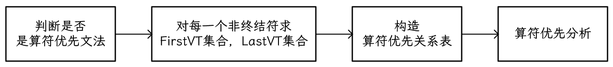
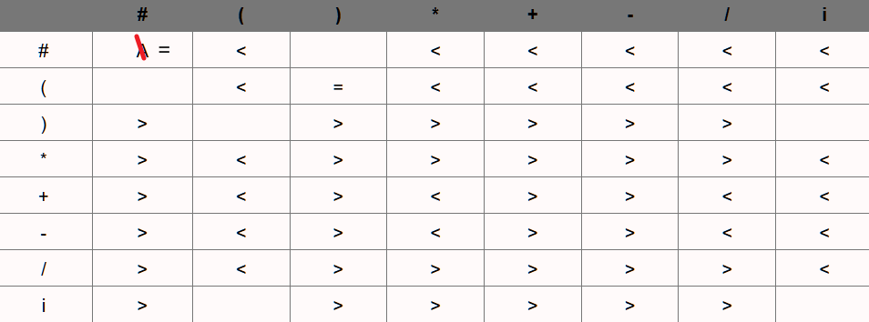
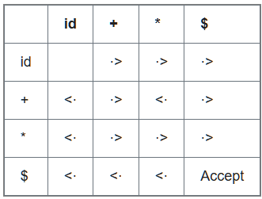
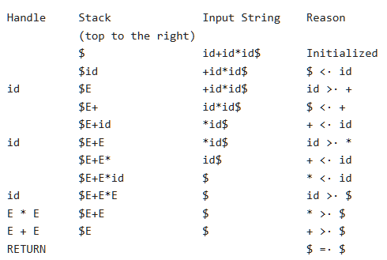

## 4.5 自底向上语法分析

- (Bottom-Up Parsing)

自底向上语法分析（Bottom-Up Parsing）对应于为输入串构造语法分析树的过程，该过程从叶子节点（底部）开始，逐步向上到达根节点（顶部）。

> **直观理解**：自底向上分析就像是侦探破案。侦探从现场发现的零散线索（终结符）开始，将它们组合成更大的线索块（将产生式体归约为产生式头），不断地进行推理和组合，最终还原出整个案件的全貌（归约为开始符号）。**借助语法树进行分析很方便**

这个过程可以看作是将一个输入串 $w$ **归约（reducing）** 为文法的开始符号。在归约的每一步，一个与某个产生式体匹配的特定子串被替换为该产生式的头（非终结符）。自底向上分析的关键决策是**何时归约**以及**用哪个句柄归约**。

> 自底向上分析的核心工作流：
>
> 1. 不断将输入符号移入分析栈
> 2. 当分析栈顶部形成一个句柄时，就将其归约为对应的产生式左部


[图片占位：一张展示对 id * id 进行自底向上分析的语法树构建快照序列。]

自底向上分析（**移进-规约**分析）实际上是反向构造一个**最右推导（rightmost derivation）**。

> 任何可以用**移进规约**分析法成功解析的文法，一定属于LR文法
>
> LR文法能够构建移进规约分析器，解析器生成器工具（Yacc）使用此文法

### 4.5.1 归约 

- (Reductions)

归约是推导步骤的逆过程。在自底向上分析中，我们的目标是反向构造一个推导。

**例题4.37**: 考虑表达式文法 (4.1) 


和输入串 $\textbf{id} * \textbf{id}$。归约过程可能经历以下字符串序列：

1.  $\textbf{id}*\textbf{id}$
2.  $F * \textbf{id}$ (将最左边的 $\textbf{id}$ 归约为 $F$，使用产生式 $F \rightarrow \textbf{id}$)
3.  $T * \textbf{id}$ (将 $F$ 归约为 $T$，使用产生式 $T \rightarrow F$)
4.  $T * F$ (将第二个 $\textbf{id}$ 归约为 $F$)
5.  $T$ (将 $T*F$ 归约为 $T$，使用产生式 $T \rightarrow T*F$)
6.  $E$ (将 $T$ 归约为 $E$，使用产生式 $E \rightarrow T$)

这个归约序列对应的最右推导是：

$$
E \Rightarrow_{rm} T \Rightarrow_{rm} T*F \Rightarrow_{rm} T*\textbf{id} \Rightarrow_{rm} F*\textbf{id} \Rightarrow_{rm} \textbf{id}*\textbf{id}
$$

### 4.5.2 句柄剪枝

- (Handle Pruning)

自底向上分析在从左到右扫描输入时，反向构造一个最右推导。

**句柄**

**一句话：当前句型 $\gamma$ 中找到一个子串 $\beta$ 将其换回 $A$， 看得到的是不是上一步的句型，若是，那么 $\beta$​ 就是句柄**

---

> **定义：句柄 (Handle)**
> 非正式地说，“句柄”是与某个产生式体匹配的子串，并且它的归约代表了最右推导逆过程中的一步。
>
> **直观理解**：句柄是当前句型中“最先”形成的那部分。它不是任何一个匹配产生式体的子串都可以。例如，在句型 $T * \textbf{id}$ 中，虽然子串 $T$ 匹配产生式 $E \rightarrow T$ 的体，但它不是句柄。因为在最右推导中，$T*\textbf{id}$ 是由 $T*F$ 推导出来的，而不是由 $E*\textbf{id}$ 推导出来的。正确的下一步归约应该是将 $\textbf{id}$ 归约为 $F$。因此，$\textbf{id}$ 才是句柄。
>

**形式化定义**
如果 $S \Rightarrow_{rm}^* \alpha A w \Rightarrow_{rm} \alpha \beta w$，其中 $w$ 仅包含终结符，那么在右句型(right-sentential) $\alpha \beta w$ 中，紧跟在 $\alpha$ 之后的位置上的产生式 $A \rightarrow \beta$ 就是一个**句柄**。
或者，右句型 $\gamma$ 的一个句柄，是由一个产生式 $A \to \beta$ 和 $\gamma$ 中的一个特定位置共同定义的。其条件是：将在该位置的子串 $\beta$ 替换为非终结符 $A$后，所得到的新字符串，恰好是 $\gamma$ 在其最右推导序列中的前一个右句型

>右句型：似乎是串的最右侧为终结符，最右推导的中间结果


[图片占位：一棵语法分析树，展示了句柄 A -> β 在右句型 αβw 中的位置。]

如果一个文法是无歧义的，那么它的每个右句型都只有一个唯一的句柄。通过反复进行“**句柄剪枝**”（即找到并归约句柄，得到前一个右句型），我们可以从一个句子开始，逐步归约，最终得到开始符号。

#### 4.5.2.A一些概念

---

**利用语法树求解短语，直接短语，句柄，直接短语，句柄，素短语，最左素短语**

从文法的开始符号经过0步或若干步推导所得到的符号串是文法的一个**句型**。

只含终结符的句型叫做**句子**。

文法的所有句子的全体叫做**语言**，记作L(G)。

一个句型对应的语法树中，任一子树的叶节点所组成的符号串都是该句型的**短语**。

一个句型对应的语法树中，任一**最小子树**（只有两层）的叶节点所组成的符号串都是该句型的**直接短语**。

同一个句型的所有直接短语中，在语法树中最靠左的那个叫做句型的**句柄**。

**素短语**是特殊的短语，它包含至少一个终结符，且其本身不包含其他素短语。

在语法树中最靠左的素短语叫做**最左素短语**。

一个字的任意首部（包括ε）称为字的**前缀**。

**活前缀**：规范句型的一个前缀，这种前缀不含句柄之后的任何符号。

---

### 4.5.3 移入-归约语法分析 

- (Shift-Reduce Parsing)

移入-归约语法分析是自底向上分析的一种形式，它使用一个**栈**来存放文法符号，一个**输入缓冲区**存放待处理的字符串。
*   **核心思想**：句柄总是在被识别为句柄之前出现在栈顶。
*   **约定**：我们使用 `$` 标记栈底和输入串的末尾。在讨论自底向上分析时，通常将栈顶显示在右侧。


**分析器的四种可能动作**：
1.  **移入 (Shift)**：将下一个输入符号移到栈顶。
2.  **归约 (Reduce)**：当栈顶的符号串形成一个句柄 $\beta$ 时，用相应的产生式头 $A$ 替换它 ($A \rightarrow \beta$)。
3.  **接受 (Accept)**：当栈中只包含开始符号且输入缓冲区为空时，宣布分析成功。
4.  **报错 (Error)**：发现一个语法错误，并调用错误恢复例程。

**例题**: 对输入串 `id * id` 进行移入-归约分析。

| STACK               | INPUT                          | ACTION                                |
| :------------------ | :----------------------------- | :------------------------------------ |
| $                   | $\textbf{id} \ * \textbf{id}$ $ | shift                                 |
| \$ $\textbf{id}$     | $\ * \textbf{id}$ $             | reduce by $F \rightarrow \textbf{id}$ |
| $ F                 | $\ * \textbf{id}$ $             | reduce by $T \rightarrow F$           |
| $ T                 | $\ * \textbf{id}$ $             | shift                                 |
| $ T   *           | $\textbf{id}$ $                | shift                                 |
| \$ T* $\textbf{id}$ | $                              | reduce by $F \rightarrow \textbf{id}$ |
| $T  * F          | $                              | reduce by $T \rightarrow T * F$       |
| $ T                | $                              | reduce by $E \rightarrow T$           |
| $ E                 | $                              | accept                                |

### 4.5.4 移入-归约分析中的冲突 

- (Conflicts During Shift-Reduce Parsing)

对于某些上下文无关文法，移入-归约分析是不可行的，因为分析器可能会遇到无法做出唯一决定的配置。这类文法被称为**非LR文法**。

**1. 移入/归约冲突 (Shift/Reduce Conflict)**

> **定义**：分析器在某个状态下，既可以对栈顶的句柄进行归约，也可以将下一个输入符号移入栈中。
> **直观理解**：分析器面临一个抉择：“我是应该满足于现在栈顶已形成的结构（归约），还是应该等待更多的输入符号进来，以形成一个更大的结构（移入）？”
> **经典例子**：悬空-else文法。当栈顶是 `if expr then stmt`，而下一个输入是 `else` 时，分析器不知道是应该将 `else` 移入（与当前的 `then` 匹配），还是应该将 `if expr then stmt` 归约为 `stmt`（认为这是一个没有 `else` 的if语句）。

**2. 归约/归约冲突 (Reduce/Reduce Conflict)**

> **定义**：分析器在某个状态下，栈顶的符号串可以匹配多个产生式的体，导致它不知道应该用哪个产生式进行归约。
> **直观理解**：分析器确定要归约，但发现栈顶的这个“线索块”可以由不止一种方式解释，即它可以归约为不同的非终结符。
> **例子**: 考虑一个语言，其中过程调用和数组引用的语法形式相同，例如 `id(parameter_list)`。假设文法中有如下产生式：
> ```
> (5) parameter -> id
> (7) expr -> id
> ```
> 当分析器看到 `p(i, j)` 并将 `p(i` 移入栈后，下一个输入是 `,`。栈顶的 `i`（一个`id`）需要被归约。但它应该被归约为 `parameter`（如果`p`是过程）还是 `expr`（如果`p`是数组）？仅凭语法信息无法决定。这种决策需要符号表中的信息。

### 4.5.5 Exercises for Section 4.5

## 4.5.A算符优先分析法

[编译原理期末速成bilibili——P5-6](https://www.bilibili.com/video/BV1Qb4y1Y7oJ/?spm_id_from=333.1387.upload.video_card.click&vd_source=91393d9709ce53cabe55a09644afd371)

一种简单直观的**自底向上**分析方法，只适用于**算符优先文法**，是一个不大的文法类。

核心思路：定义算符（终结符）之间某种优先关系，利用这种优先关系寻找 **"可归约串"**。



<center>图 算符优先分析法流程图</center>>

### 1.算符优先文法的判断

**定义**

---

**Step1.** 判断是否是**算符文法**，"**没有相邻非终结符出现在产生式右部**"

**Step2.** 假设G是不含 $\varepsilon$ 产生式的算符文法。对于任意一对终结符a,b。定义：

-  $a\doteq b$ ，当且仅当G中含有形如 $P\to \cdots ab\cdots$ 或 $P \to \cdots aQb \cdots$ 的产生式
-  $a \lessdot b$ ，当且仅当G中含有形如 $P\to \cdots aR \cdots$ 的产生式 而 $R\overset{+}{\rightarrow} b\cdots | Qb\cdots$
- $a \gtrdot b$ ，当且仅当G中含有形如 $P\to \cdots Rb\cdots$的产生式，而$R\overset{+}{\rightarrow} \cdots a | \cdots aQ$

如果一个算符文法G中的任何终结符对（a,b）最多满足上述三个条件之一，则称G是一个**算符优先文法**。

$\cdots$​​ 代表由终结符和非终结符组成的任意序列，包括空字。

---

第一步可以在构造**优先关系表**时体现，需要我们检查的只有是否有空产生式

>**具体判断** 
>
>- 不是：选择一对终结符，说明其满足两种优先级关系
>- 是：`该文法任一产生式右部都不含两个相继的非终结符，故为算符文法。从优先关系表可以看出，任何两个终结符之间至多满足=，<，>，三种关系之一，故该文法为算符优先文法。`

> 为什么这样定义优先级：
>
> 通过定义优先级，标识句柄的**开始和结束**

| 关系    | 栈顶 `a` vs 输入 `b`  | 含义                                     | 动作                         | 目的                                       |
| :------ | :-------------------- | :--------------------------------------- | :--------------------------- | :----------------------------------------- |
| **`<`** | `a` 的优先级低        | 句柄**还没开始**，`b` 是一个新句柄的开始 | **Shift (移入)** `b`         | 进入更高优先级的子表达式                   |
| **`≐`** | `a` 和 `b` 优先级相同 | `a` 和 `b` 在**同一个句柄**内部          | **Shift (移入)** `b`         | 继续构建当前句柄                           |
| **`>`** | `a` 的优先级高        | 栈顶的 `a` 是一个句柄的**结尾**          | **Reduce (归约)** 栈顶的句柄 | 已经找到了一个完整的子表达式，可以处理它了 |
### 2.构造集合

>为什么需要构造FirstVT和LastVT两个集合？
>在对**算符优先级**进行定义时，需要寻找一个非终结符的首终结符和尾终结符，定义：
>
>- 首终结符集， $FIRSTVT(B) = \{b \mid B \rightarrow b... \text{或} B \rightarrow Cb...\}$
>
>- 尾终结符集， $LASTVT(B) = \{b \mid B \rightarrow ...b \text{或} B \rightarrow ...bC\}$​
>
>所以，这是对算符优先级新的表示
>
>- =关系， $A\to \cdots ab\cdots|\cdots aRb\cdots$
>
>- <关系， $A\to \cdots aB\cdots$ ，对于每一个 $b \in FirstVT(B)$ ，都有a<b
>
>- \> 关系， $A\to \cdots Bb\cdots$ ，对于每一个 $a\in LastVT(B)$ ，都有a>b

##### FirstVT集合

> 若有产生式 $P\to a\cdots$ 或 $P\to Ra\cdots$ ，则 $a\in FirstVT(P)$
>
> 若有产生式 $P\to R\cdots$ ，则 $FirstVT(R)\in FirstVT(P)$​
>
> > 即每个产生式第一个终结符，向下递归。从前向后看

##### LastVT集合

> 若有产生式 $B\to \cdots a$ 或 $B\to\cdots aQ$ ，则 $a\in LastVT(B)$
>
> 若有产生式 $B\to \cdots Q$ ，则 $LastVT(Q) \in LastVT(B)$​ 
>
> >即每个产生式最后一个终结符，向下递归。从后向前看

**Exercises for A.1**

| 文法                                                         | 集合                                                         |
| ------------------------------------------------------------ | ------------------------------------------------------------ |
| $G[E]$:<br>$E\to E+T|E-T|T$<br>$T\to T*F|T/F|F$<br>$F\to(E)|i$ | $FirstVT[E] = \{ ( * + - / i \}$<br/> $FirstVT[F] = \{ ( i \}$<br/> $FirstVT[T] = \{ ( * / i \}$<br/> $LastVT[E] =\{ ) * + - / i \}$ <br/> $LastVT[F] = \{ ) \ i \}$ <br/>$LastVT[T] = \{ ) * / i \}$<br/> |

**步骤：**

**求 $E$ 的 $FirstVT$ 时**，对于 $E\to E+T$ 第一个终结符为 $+$ ， $E\to E-T$ 同理，

对于 $E\to T$，向下递归， 对于 $T\to T*F$ 第一个终结符为 $*$ ，$T\to T/F$ 同理，

对于 $T\to F$ ，向下递归，对于 $F\to(E)$ ，第一个终结符为 $($ ，对于 $F\to i$ ，第一个终结符为 $i$

所以 $FirstVT(E)=\{+,-,*,/,(,i\}$

**求 $E$ 的 $LastVT$ 时**，从后向前看第一个终结符，对于 $E\to E+T$，最后一个终结符为 $+$ ，等等

### 3.构造优先关系表

**如果一个文法构造出的优先关系表没有冲突项，该文法为算符优先文法**

- 如果存在 $P\to \cdots ab\cdots$ 或者 $P \to \cdots aQb \cdots$ 则置 $a=b$ ，横看
- 如果存在 $Q\to \cdots aP\cdots$ ，则对于 $b\in FirstVT(P)$ ，$a<b$  ，横看
- 如果存在 $Q\to\cdots Pb\cdots$ ，则对于 $a\in LastVT(P)$ ，$a>b$ ，竖看

**步骤：**行列写出 所有终结符+开始结束符号#，添加  $\#S\#，S$ 为开始符号

1. 找相等优先级
2. 找 **"终结符a+非终结符P"** 形式，找到a所在行，若元素在 $FirstVT(P)$ 中，相应位置写 $\lessdot$
3. 找 **"非终结符P+终结符b"** 形式，找到b所在列，若元素在 $LastVT(P)$ 中，相应位置写 $\gtrdot$



### 4.算符优先分析

算符优先分析法的基本原理是：**识别句柄并归约**，比较**栈顶终结符** $a$ 和**输入的下一个符号** $b$ 的优先级，如果**"栈顶终结符"**的优先级低，则**"移进"**输入字符串的下一个符号，如果**"栈顶终结符"**优先级高，则去寻找句柄进行**"归约"**

**例：设算符文法为：**

---

$\begin{align*} E & \to E + T \mid T \\ T & \to T * F \mid F \\ F & \to \text{id} \end{align*}$

---



<center>优先关系表</center>

**对 $id + id * id$ 进行分析**

向输入字符**插入优先关系**后，得到符号串 $\$\lessdot id\gtrdot+\lessdot id\gtrdot *\lessdot id\gtrdot \$$

经过下面的过程得到**句柄**：

1. 从左向右扫描串，如果**输入元素优先级高于当前元素，移入输入元素**。直到遇到第一个 $\gtrdot$ （**输入元素优先级低于当前元素**）
2. 找到 $\gtrdot$ 后，向左扫描，跳过所有 $\doteq$ ,直到遇到一个 $\lessdot$ 为止
3. **句柄**包括第二步遇到的 $\lessdot$ 到第一个 $\gtrdot$ 之间的所有内容，由于 $id$ 可以归约为 $E$ ，从而得到右句型 $E + id * id$ ，按同样步骤将剩余两个 $id$ 归约，得到右句型 $E + E * E$ 
4. 现在考虑**忽略非终结符**后的符号串 $\$\lessdot +\lessdot *\gtrdot \$$ ，与前面过程类似可得**句柄**位于 $*$ 附近，即右句型 $E + E * E$ 中，句柄为 $E*E$ ，两边非终结符也在其中

用栈实现上述"**移进—归约**"算法如下：



分析过程中的可能情况（移进—归约分析器的四种可能动作）：

- 移进，输入元素大于栈顶元素
- 归约，输入元素小于栈顶元素
- 接受：$$相遇
- 报错：栈顶元素和当前输入元素没有优先关系