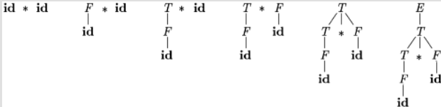
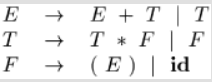
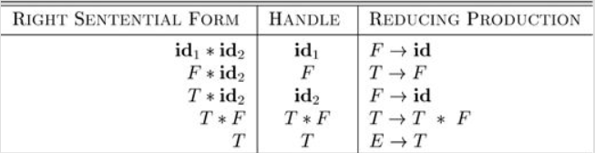
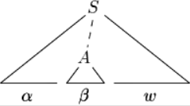
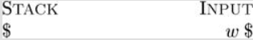

## 4.5 自底向上语法分析 

- (Bottom-Up Parsing)

自底向上语法分析（Bottom-Up Parsing）对应于为输入串构造语法分析树的过程，该过程从叶子节点（底部）开始，逐步向上到达根节点（顶部）。

> **直观理解**：自底向上分析就像是侦探破案。侦探从现场发现的零散线索（终结符）开始，将它们组合成更大的线索块（将产生式体归约为产生式头），不断地进行推理和组合，最终还原出整个案件的全貌（归约为开始符号）。**借助语法树进行分析很方便**

这个过程可以看作是将一个输入串 $w$ **归约（reducing）**为文法的开始符号。在归约的每一步，一个与某个产生式体匹配的特定子串被替换为该产生式的头（非终结符）。自底向上分析的关键决策是**何时归约**以及**应用哪个产生式进行归约**。



[图片占位：一张展示对 id * id 进行自底向上分析的语法树构建快照序列。]

自底向上分析（**移进-规约**分析）实际上是反向构造一个**最右推导（rightmost derivation）**。

> 任何可以用**移进规约**分析法成功解析的文法，一定属于LR文法
>
> LR文法能够构建移进规约分析器，解析器生成器工具（Yacc）使用此文法

### 4.5.1 归约 

- (Reductions)

归约是推导步骤的逆过程。在自底向上分析中，我们的目标是反向构造一个推导。

**例题4.37**: 考虑表达式文法 (4.1) 



和输入串 $\textbf{id} * \textbf{id}$。归约过程可能经历以下字符串序列：

1.  $\textbf{id}*\textbf{id}$
2.  $F * \textbf{id}$ (将最左边的 $\textbf{id}$ 归约为 $F$，使用产生式 $F \rightarrow \textbf{id}$)
3.  $T * \textbf{id}$ (将 $F$ 归约为 $T$，使用产生式 $T \rightarrow F$)
4.  $T * F$ (将第二个 $\textbf{id}$ 归约为 $F$)
5.  $T$ (将 $T*F$ 归约为 $T$，使用产生式 $T \rightarrow T*F$)
6.  $E$ (将 $T$ 归约为 $E$，使用产生式 $E \rightarrow T$)

这个归约序列对应的最右推导是：

$$
E \Rightarrow_{rm} T \Rightarrow_{rm} T*F \Rightarrow_{rm} T*\textbf{id} \Rightarrow_{rm} F*\textbf{id} \Rightarrow_{rm} \textbf{id}*\textbf{id}
$$

### 4.5.2 句柄剪枝

- (Handle Pruning)

自底向上分析在从左到右扫描输入时，反向构造一个最右推导。

> **定义：句柄 (Handle)**
> 非正式地说，“句柄”是与某个产生式体匹配的子串，并且它的归约代表了最右推导逆过程中的一步。
>
> **直观理解**：句柄是当前句型中“最先”形成的那部分。它不是任何一个匹配产生式体的子串都可以。例如，在句型 $T * \textbf{id}$ 中，虽然子串 $T$ 匹配产生式 $E \rightarrow T$ 的体，但它不是句柄。因为在最右推导中，$T*\textbf{id}$ 是由 $T*F$ 推导出来的，而不是由 $E*\textbf{id}$ 推导出来的。正确的下一步归约应该是将 $\textbf{id}$ 归约为 $F$。因此，$\textbf{id}$ 才是句柄。
>

**形式化定义**
如果 $S \Rightarrow_{rm}^* \alpha A w \Rightarrow_{rm} \alpha \beta w$，其中 $w$ 仅包含终结符，那么在右句型(right-sentential) $\alpha \beta w$ 中，紧跟在 $\alpha$ 之后的位置上的产生式 $A \rightarrow \beta$ 就是一个**句柄**。
或者，右句型 $\gamma$ 的一个句柄，是由一个产生式 $A \to \beta$ 和 $\gamma$ 中的一个特定位置共同定义的。其条件是：将在该位置的子串 $\beta$ 替换为非终结符 $A$后，所得到的新字符串，恰好是 $\gamma$ 在其最右推导序列中的前一个右句型
>**直观理解**：当前句型 $\gamma$ 中找到一个子串 $\beta$ 将其换回 $A$， 看得到的是不是上一步的句型，若是，那么 $\beta$ 就是句柄

>右句型：似乎是串的最右侧为终结符，最右推导的中间结果


[图片占位：一棵语法分析树，展示了句柄 A -> β 在右句型 αβw 中的位置。]

如果一个文法是无歧义的，那么它的每个右句型都只有一个唯一的句柄。通过反复进行“**句柄剪枝**”（即找到并归约句柄，得到前一个右句型），我们可以从一个句子开始，逐步归约，最终得到开始符号。

### 4.5.3 移入-归约语法分析 

- (Shift-Reduce Parsing)

移入-归约语法分析是自底向上分析的一种形式，它使用一个**栈**来存放文法符号，一个**输入缓冲区**存放待处理的字符串。
*   **核心思想**：句柄总是在被识别为句柄之前出现在栈顶。
*   **约定**：我们使用 `$` 标记栈底和输入串的末尾。在讨论自底向上分析时，通常将栈顶显示在右侧。


**分析器的四种可能动作**：
1.  **移入 (Shift)**：将下一个输入符号移到栈顶。
2.  **归约 (Reduce)**：当栈顶的符号串形成一个句柄 $\beta$ 时，用相应的产生式头 $A$ 替换它 ($A \rightarrow \beta$)。
3.  **接受 (Accept)**：当栈中只包含开始符号且输入缓冲区为空时，宣布分析成功。
4.  **报错 (Error)**：发现一个语法错误，并调用错误恢复例程。

**例题**: 对输入串 `id * id` 进行移入-归约分析。

| STACK               | INPUT                          | ACTION                                |
| :------------------ | :----------------------------- | :------------------------------------ |
| $                   | $\textbf{id} \\* \textbf{id}$ $ | shift                                 |
| $$\textbf{id}$     | $\\* \textbf{id}$ $             | reduce by $F \rightarrow \textbf{id}$ |
| $ F                 | $\\* \textbf{id}$ $             | reduce by $T \rightarrow F$           |
| $ T                 | $\\* \textbf{id}$ $             | shift                                 |
| $ T \*              | $\textbf{id}$ $                | shift                                 |
| $$T \\* \textbf{id}$ | $                              | reduce by $F \rightarrow \textbf{id}$ |
| $ T \* F            | $                              | reduce by $T \rightarrow T * F$       |
| $ T                 | $                              | reduce by $E \rightarrow T$           |
| $ E                 | $                              | accept                                |

### 4.5.4 移入-归约分析中的冲突 

- (Conflicts During Shift-Reduce Parsing)

对于某些上下文无关文法，移入-归约分析是不可行的，因为分析器可能会遇到无法做出唯一决定的配置。这类文法被称为**非LR文法**。

**1. 移入/归约冲突 (Shift/Reduce Conflict)**

> **定义**：分析器在某个状态下，既可以对栈顶的句柄进行归约，也可以将下一个输入符号移入栈中。
> **直观理解**：分析器面临一个抉择：“我是应该满足于现在栈顶已形成的结构（归约），还是应该等待更多的输入符号进来，以形成一个更大的结构（移入）？”
> **经典例子**：悬空-else文法。当栈顶是 `if expr then stmt`，而下一个输入是 `else` 时，分析器不知道是应该将 `else` 移入（与当前的 `then` 匹配），还是应该将 `if expr then stmt` 归约为 `stmt`（认为这是一个没有 `else` 的if语句）。

**2. 归约/归约冲突 (Reduce/Reduce Conflict)**

> **定义**：分析器在某个状态下，栈顶的符号串可以匹配多个产生式的体，导致它不知道应该用哪个产生式进行归约。
> **直观理解**：分析器确定要归约，但发现栈顶的这个“线索块”可以由不止一种方式解释，即它可以归约为不同的非终结符。
> **例子**: 考虑一个语言，其中过程调用和数组引用的语法形式相同，例如 `id(parameter_list)`。假设文法中有如下产生式：
> ```
> (5) parameter -> id
> (7) expr -> id
> ```
> 当分析器看到 `p(i, j)` 并将 `p(i` 移入栈后，下一个输入是 `,`。栈顶的 `i`（一个`id`）需要被归约。但它应该被归约为 `parameter`（如果`p`是过程）还是 `expr`（如果`p`是数组）？仅凭语法信息无法决定。这种决策需要符号表中的信息。

### 4.5.5 Exercises for Section 4.5

## 4.5.A算符优先分析法

一种简单直观的**自底向上**分析方法，只适用于**算符优先文法**，是一个不大的文法类。

核心思路：定义算符（终结符）之间某种优先关系，利用这种优先关系寻找**"可归约串"**。

### 4.5.A.1算法优先文法判断

**Step1.** 判断是否是**算符文法**，"**没有相邻非终结符出现在产生式右部**"

**Step2.** 假设G是不含 $\varepsilon$ 产生式的算符文法。对于任意一对终结符a,b。定义：

- a=b，当且仅当G中含有形如 $P\to \cdots ab\cdots$ 或 $P \to \cdots aQb \cdots$ 的产生式
- a<b，当且仅当G中含有形如 $P\to \cdots $
- a>b，当且仅当G中含有形如 $$

如果一个算符文法G中的任何终结符对（a,b）最多满足上述三个条件之一，则称G是一个**算符优先文法**。

