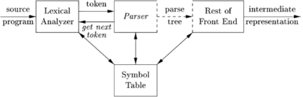
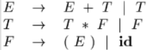
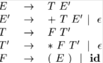
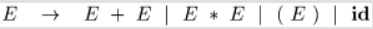
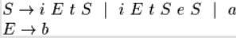

### 4.1 语法分析器介绍

- **核心任务**：检查**词法分析器输出的Token流**，判断这个Token序列能否构成一个符号语法规则的句子
- 语法分析(parsing)阶段的任务包括：与符号表交互，类型检查，语义分析，生成中间代码，但此处将其归并到“前端剩余部分”（Rest of front end）介绍
- 
- **在编译器中的位置**：编译器**前端的核心**，承上启下
	- **输入**：接收词法分析器输出的Token流
	- **输出**：生成语法分析树，传递给前端剩余部分
- **两种流派：** 语法分析器主要分为两种实现思路，但都是从左向右扫描输入
	- **自顶向下分析**：从开始符号出发，推导出目标句子
	- **自底向上分析**：从输入句子出发，尝试规约道开始符号
- **文法适用性**：
	- **LL文法**：常用于**手工构建**自顶向下的分析器
	- **LR文法**：常用于**自动构建**自底向上的分析器
#### 几种代表文法

##### 算符结合性与优先级



- 属于LR文法，可用于自底向上分析，不能用于自顶向下分析，因为存在**左递归**
- E represents expressions consisting of terms separated by + signs
- T represents terms consisting of factors separated by  * signs
- F represents factors that can be either parenthesized expressions or identifiers
##### 无左递归



- 可以用于自顶向下分析

##### 存在二义性



- 某些表达式的语法分析树不唯一

### 4.2 上下文无关文法（CFG）
语法分析器基于上下文无关文法工作
#### 基本构成
A context-free grammar consists of terminals, nonterminals, a start symbol, and productions.
- **终结符(Terminals)** 语言的基本符号，等同于词法单元名
- **非终结符(Nonterminals)** 语法的变量，代表终结符串的集合，用于构建语法层次
- **产生式(Productions)** 定义非终结符可以如何被替换为终结符和非终结符集合
- **开始符号(Start Symbol)**，一个特殊的非终结符，是推导的起点
#### 重要概念
- **推导(Derivation)**，从开始符号出发，不断应用产生式，最终得到字符串的过程
	- **最左推导**：每次替换最左非终结符
	- **最右推导（规范推导）**：每次替换最右非终结符
- **分析树(Parsing Tree)**：推导过程的图形化表示 ，一棵分析树可以对应多个推导过程，但**只能对应唯一最左推导和唯一最右推导**
- **二义文法(Ambiguous Grammat)**：对同一个句子有不同的最左或最右推导/生成多颗不同的分析树。二义性是语法分析中需要解决的问题。
- **规约**：构造一棵产出为 $a_i$ 的分析树
- **句型、句子**：如果 $S\stackrel{*}{\Rightarrow}\alpha$，S是文法G的开始符号，称 $\alpha$ 为G的一个句型，当 $\alpha$ 中无非终结符，称为文法G句子
- **语言L(G)**：文法的语言 $L(G)$ 是所有句子的集合，能由文法产生的语言称为上下文无关语言

#### 表达能力

CFG表达能力强于正则表达式（RE）

### 4.3构造文法
几种应用于语法的变换，使其更适合进行语法分析
- 消除二义性
- 左递归，左提取用于重写语法，使其适应自顶向下分析
#### 4.3.1语法分析和词法分析比较
文法可以表示正则表达式所描述的东西，那么为什么需要正则表达式来定义词法？
- 词法规则相较语法简单，无需更复杂的文法即可描述
- 将语言语法结构分为词法和语法两部分，有利于将编译器前端分解为两个独立组件
- 正则表达式为Token提供一种更为简单，简洁的符号表示法
- 利用正则表达式可以构造更为高效的词法分析器
#### 4.3.2消除二义性

#### 4.3.3消除左递归

自顶向下分析无法处理左递归文法

> 原文法： $A \rightarrow A\alpha_1 \mid A\alpha_2 \mid \ldots \mid A\alpha_m \mid \beta_1 \mid \beta_2 \mid \ldots \mid \beta_n$
>
> 消除左递归之后：
>
>  $A \rightarrow \beta_1 A' \mid \beta_2 A' \mid \ldots \mid \beta_n A' $
>
>  $A' \rightarrow \alpha_1 A' \mid \alpha_2 A' \mid \ldots \mid \alpha_m A' \mid \varepsilon$

#### 4.3.4消除回溯（左因子提取）

当两个可选产生式选择不明时，重写文法，推迟决策

> **Algorithm**：Left factoring a grammar
>
> **Input**：Grammar G
>
> **Output**：An equivalent left-factored grammar.
>
> 原文法： $A\to\alpha\beta_1|\alpha\beta_2|...|\alpha\beta_n|\gamma$
>
> 改造后的文法： $A\to \alpha A'|\gamma$        $A'\to \beta_1|\beta_2|...|\beta_n$

例1.

### 4.4自顶向下分析

核心思想：从开始符号出发，应用产生式，尝试推导出于输入（Token流)完全匹配的句子。有两种实现算法：

#### 递归下降算法

递归下降是一种**自顶向下**的语法分析算法，其是否回溯需要根据文法的性质决定（如LL(1)文法不需要），无法处理左递归文法。

对于不需要回溯的文法，递归下降的实现如下（即预测性解析Predictive parsing）

**核心思想：**

- 每一个非终结符构造一个**分析函数**parse_N()
- **前看符号**指导产生式选择

**工作流程**（在一个Parse_N()内部）：

1. **选择产生式**，查看当前**前看符号**，即输入流中下一个Token，根据Token来决定选择哪一个产生式。 $A \to X_1X_2...X_n$
2. 匹配产生式体：
	1. 如果 $X_i$ 是一个**非终结符**，则**递归调用**对应分析函数
	2. 如果 $X_i$ 是一个**终结符**，将其与当前输入Token进行**匹配**。若匹配成功，则消耗Token，输入指针后移
	3. 若不匹配，则报告语法错误
**优点**：线性时间，实现逻辑简单

```c  file:递归下降 fold
void A() {
    // 1) 选择一个 A 的产生式, A -> X1 X2 ... Xk;
    Choose an A-production, A -> X1 X2 ... Xk;
    // 2) for (i = 1 to k) {
    for (i = 1 to k) {
        // 3) if (Xi 是一个非终结符)
        if (Xi is a nonterminal) {
            // 4) 调用 Xi();
            call procedure Xi();
        // 5) else if (Xi 等于当前的输入符号 a)
        } else if (Xi equals the current input symbol a) {
            // 6) 将输入指针移到下一个符号;
            advance the input to the next symbol;
        // 7) else /* 发生错误 */;
        } else /* an error has occurred */;
    }
}
```
#### LL(1)分析

**名称含义**：从左（L）向右读入程序，最左（L）推导，采用一个前看符号(1)
核心思想：不使用递归函数调用，而是利用一个**分析栈**和一个预先计算好的**分析表**驱动分析过程。

- 分析表是关键
	- **列**：非终结符+“#”，**行**：终结符，
	- **项**：存放当前栈顶为终结符A且输入为终结符t时，应该使用的产生式
**LL(1)文法**：若表中每一项只有一条产生式，则成为LL(1)文法
若表中每一项有多种可能，则出现冲突

>**构造LL(1)分析表关键：三个集合的计算**
>根据下一个输入符号，结合First和Follow集合选择需要应用的产生式
##### LL(1)文法

两种等价说法：

- 无二义性，不含左递归，不含回溯
- 分析表中不存在冲突项

###### 判断是否是LL(1)文法

核心思想：**检查文法中的每一个终结符，确保在分析表中不会产生冲突**

一个**上下文无关文法**是**LL(1)文法**的充要条件（判断一个文法是否是LL(1)文法）：对每一个非终结符 \(A\) 的任何两个不同的产生式 \( $A \rightarrow \alpha \mid \beta$ \)，有下面条件（都是避免了多重入口）成立：

1. 若 $\beta$ 不能推出空串， $\text{FIRST}(\alpha) \cap \text{FIRST}(\beta) = \emptyset$ ： $A$ 的每个候选式都不存在相同的首字符。
2. 若 $\beta$ 可以推出空串 ，则有 $\text{FIRST}(\alpha) \cap \text{FOLLOW}(A) = \emptyset$ ：（用 $\alpha$ 推出推出的第一个字符，是A之后看你出现的终结符）避免了在分析表同一栏目内出现 $A \rightarrow \alpha$ 和 $A \rightarrow \varepsilon$ 的情况。

> 具体来讲，观察题目所给文法，是否存在一个非终结符有多个产生式
>
> - 若存在，则执行以下两个判断
>   - 若没有推导出空串的产生式，保证 $\text{FIRST}(\alpha) \cap \text{FIRST}(\beta) = \emptyset$ 
>   - 若有推导出空串的产生式，如$\beta$ 可以推出空串， 保证$\text{FIRST}(\alpha) \cap \text{FOLLOW}(A) = \emptyset$
> - 若不存在，是LL(1)文法

##### Nullable集合

- **定义**：文法中所有能推导出**空串**的非终结符集合
- **作用**：计算First和Follow集合基础
##### First集合

- **定义First(N)**：从非终结符N出发，所能推导出所有字符串的**第一个终结符**的集合
- **计算规则**：看产生式左边
	- **基本情况**：若 $N\to a\cdots$ ，则a在First(N)中。
	- **扩展情况**：若 $N \to Y_1Y_2\cdots$ ，则First( $Y_1$ )（除空串）在First(N)中。若 $Y_1$ 是Nullable的，则First ($Y_2$ )（除空串）在First(N)中，以此类推。
- **分析表中的作用**：对于产生式 $A\to a$ ，将这条产生式填入分析表所有M\[A,t]中，其中t是First(a)里每一个终结符
> 具体做法，求解First集合看产生式左边
>
> - 如果非终结符A推导出一个终结符a开头的产生式，则加入a
> - 如果非终结符A推导出一个非终结符B开头的产生式
>   - Step1,将B的First加入A
>   - Step2,观察B的First集合中是否有空串，若有，则穿透至后面的符号，继续判断

##### Follow集合

- **定义Follow(N)**：在文法所有合法句型中，可能跟在非终结符N后面的终结符集合
- **计算规则**：看产生式右边
	1. 若S是开始符号， Follow(S) += \{\#\}​
	2. 若存在产生式， $B->\alpha A \beta$ ，则  $Follow(A)+=First(\beta)-{\varepsilon}$ 
	3. $\text{若有}B \to \alpha A\text{或}B \to \alpha A\beta, \text{且}\beta \stackrel{*}{\Rightarrow} \varepsilon $则  $Follow(A)+=Follow(B)$
	4. 直至 $FollowA$ 不再增大
- **分析表中的作用**：如果一个产生式 $A\to a$ 能够推导出空串，即空串在First(a)中，那么对于Follow(A)中的每一个终结符t，都需要将产生式 $A\to a$ （通常表示为 $A\to \varepsilon$ ）填入M\[A,t]中，这解决了当A消失后，程序应该如何继续匹配的问题。

> 具体做法，求解Follow集合看产生式右边
>
> - Step1开始符号+{#}
> - Step2观察是否有A直接跟终结符a或非终结符B
>   - 将终结符a，非终结符B的First集合减去空串，加入Follow(A)
> - Step3观察是否有A暴露在产生式右部最右边（直接暴露，间接暴露）
>   - 将产生式左侧非终结符B的Follow集合加入Follow(A)

##### 构造LL(1)分析表

For each production *A* → *α* of the grammar, do the following:

1. For each terminal $\alpha$ in FIRST (*A* ), add $A\to\alpha$  to *M* [*A* , *a* ].
2. If $\varepsilon$  is in FIRST ( $\alpha$  ), then for each terminal *b* in FOLLOW (*A* ), add $A\to\alpha$ to *M* [*A* , *b* ]. If $\varepsilon$  is in FIRST ( $\alpha$  ) and $\$$ is in FOLLOW(A)，add $A\to\alpha$ to M[A,\$]as well.

> 对于First集合中的终结符 $\alpha$ ，把对应的产生式加入M[A, $\alpha$ ]
>
> 如果First集合中有空串，检查Follow集合中的终结符b，将产生空串的产生式加入M[A,b]


